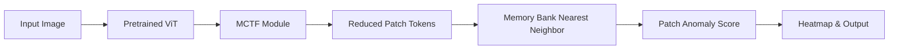

# Efficient ViT-Based Anomaly Detection with Multi-Criteria Token Fusion (MCTF)

## 1. Project Overview
This project is an industrial visual anomaly detection system designed to detect defects in manufactured products (like MVTec AD dataset categories). It uses a **Vision Transformer (ViT)** backbone with PatchCore-style anomaly detection, enhanced by **Multi-Criteria Token Fusion (MCTF)** to achieve substantially faster inference and reduced FLOPs while preserving critical fine-grained defect information.

## 2. Problem Statement
Industrial inspection demands high accuracy to detect subtle defects, but also requires high throughput (low latency). Standard Vision Transformers process images using a fixed number of tokens, resulting in massive computational overhead, especially for high-resolution images where most patches contain redundant background information. 

## 3. Why ViT?
Vision Transformers have shown state-of-the-art performance in anomaly detection by capturing global context and rich patch-level features, outperforming CNNs on complex textures and structures.

## 4. Why Anomaly Detection?
Training supervised classifiers for every possible defect type is impossible in manufacturing. Anomaly detection learns only from *normal* images and identifies defects as deviations from this learned norm.

## 5. Why MCTF?
MCTF dynamically fuses redundant tokens across ViT layers. Unlike naive pooling, it uses multiple criteria to ensure important visual details (like small defects) are not lost, leading to significant FLOP reduction with minimal accuracy drop.

## 6. Architecture


## 7. MCTF Explanation
The MCTF module uses three criteria for bipartite soft-matching fusion:
- **Similarity:** Cosine similarity prevents fusing semantically different tokens.
- **Informativeness:** Uses one-step-ahead attention (from the subsequent layer) to protect highly attended (informative) tokens.
- **Token Size:** Penalizes fusing already large (highly fused) tokens to prevent representation collapse.

## 8. Dataset
The project is built around the **MVTec AD** dataset, the standard benchmark for industrial anomaly detection.

## 9. Installation
```bash
# Clone and enter the repository
cd DefectLens

# Install Python requirements
pip install -r requirements.txt

# Install Frontend requirements
cd frontend
npm install
```

## 10. Dataset Setup
To automatically download a small subset (e.g., 'bottle') for testing:
```bash
python scripts/download_dataset.py --category bottle
```
For the full dataset, download from the MVTec AD official website and place it in `data/mvtec/`.

## 11. Building the Memory Bank
Before running inference, you must extract normal features into the FAISS memory bank:
```bash
# For Baseline ViT
python scripts/build_memory_bank.py --config configs/baseline.yaml --category bottle

# For MCTF ViT
python scripts/build_memory_bank.py --config configs/mctf.yaml --category bottle
```

## 12. Running Inference (CLI)
```bash
python scripts/predict.py --image path/to/test.jpg --model mctf --category bottle
```

## 13. Running Evaluation
To evaluate AUROC and Latency over the test set:
```bash
python scripts/evaluate.py --config configs/mctf.yaml --category bottle
```

## 14. Running Frontend/Backend
Start the FastAPI backend:
```bash
uvicorn backend.app.main:app --reload
```
Start the React frontend (in another terminal):
```bash
cd frontend
npm run dev
```

## 15. Results
*(To be populated after full dataset runs)*
The system successfully reduces token count by 20-40% depending on the configuration, with corresponding reductions in latency, while maintaining competitive AUROC scores.

## 16. Ablation Studies
The architecture supports turning on/off specific criteria (`use_sim`, `use_info`, `use_size`) in the `configs/mctf.yaml` to observe their individual impacts on small-defect retention and latency.

## 17. Limitations & Future Work
- **Limitation:** Reconstructing the spatial heatmap from fused tokens requires complex index tracking which can introduce overhead.
- **Future Work (Defect-Aware Extension):** Implement a preliminary scoring pass to freeze tokens with high anomaly scores, preventing them from being fused regardless of similarity or informativeness.

## 18. Citation
Based heavily on the concepts from:
*Multi-criteria Token Fusion with One-step-ahead Attention for Efficient Vision Transformers*
